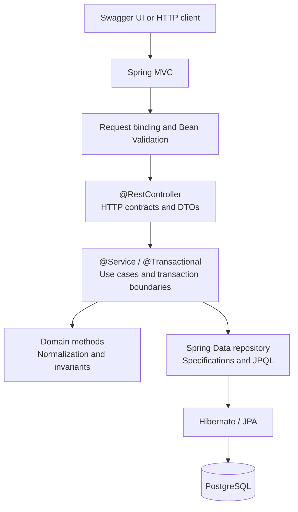

# Job Application Tracker Java

[](https://github.com/SereMark/job-application-tracker-java/actions/workflows/ci.yml)

A local REST API for managing job applications, follow-up actions, and status history.

Built with Java 21, Spring Boot, Spring MVC, Spring Data JPA, Hibernate, PostgreSQL,
Flyway, Swagger UI, Docker Compose, JUnit, Testcontainers, and GitHub Actions.

## Features

- Create, view, update, and permanently delete job applications.
- Track `Saved`, `Applied`, `Screening`, `Interview`, `Offer`, `Rejected`, and
  `Withdrawn` states with a complete status history.
- Search, filter, sort, and paginate applications.
- Record an optional next action and see overdue and upcoming work in the pipeline summary.
- Return consistent validation and error responses using RFC 9457 `ProblemDetail`.
- Persist data in PostgreSQL with Flyway migrations, constraints, and indexes.
- Run the API and database together with Docker Compose.

## Quick start

The complete stack only requires Docker Desktop or Docker Engine with Docker Compose.

1. Copy `.env.example` to `.env`.
2. Set `POSTGRES_PASSWORD` to a strong password used only for local development.
3. Build and start the stack:

```bash
docker compose up --build -d --wait
```

Once the API has started:

- API: <http://localhost:8081>
- Swagger UI: <http://localhost:8081/swagger-ui.html>
- OpenAPI document: <http://localhost:8081/v3/api-docs>
- Liveness check: <http://localhost:8081/actuator/health/liveness>
- Readiness check: <http://localhost:8081/actuator/health/readiness>

The API container waits for PostgreSQL to become healthy. Spring Boot then applies pending
Flyway migrations and validates the Hibernate mappings before the application becomes ready.

Stop the containers without deleting the database volume:

```bash
docker compose down
```

## Using the API

Swagger UI provides an interactive view of the complete OpenAPI contract. The
[HTTP request collection](requests/JobApplicationTracker.http) contains a runnable example for
every endpoint.

Create an application:

```http
POST /api/applications
Content-Type: application/json

{
  "companyName": "Example Ltd.",
  "positionTitle": "Java Developer",
  "status": "Saved",
  "jobPostingUrl": "https://example.com/jobs/java-developer",
  "source": "LinkedIn",
  "location": "Budapest",
  "nextActionDescription": "Review the job requirements",
  "nextActionDueAt": "2030-01-15T10:00:00Z"
}
```

Query the application list:

```http
GET /api/applications?search=Java&status=Saved&page=1&pageSize=20&sortBy=updatedAt&sortDirection=desc
```

Change an application's status:

```http
PATCH /api/applications/{id}/status
Content-Type: application/json

{
  "status": "Applied",
  "note": "Application submitted"
}
```

### Endpoints

| Method | Route | Purpose |
| --- | --- | --- |
| `POST` | `/api/applications` | Create an application and its initial history entry |
| `GET` | `/api/applications/{id}` | Get one application |
| `GET` | `/api/applications` | Search, filter, sort, and paginate applications |
| `PUT` | `/api/applications/{id}` | Replace editable details without changing status |
| `PATCH` | `/api/applications/{id}/status` | Change status and append a history entry |
| `GET` | `/api/applications/{id}/status-history` | Get status history in chronological order |
| `DELETE` | `/api/applications/{id}` | Delete an application and its status history |
| `GET` | `/api/applications/summary` | Get pipeline and next-action counts |
| `GET` | `/actuator/health/liveness` | Check whether the API process is running |
| `GET` | `/actuator/health/readiness` | Check whether the API can reach PostgreSQL |

The list endpoint accepts `search`, `status`, `source`, `appliedFrom`, `appliedTo`,
`nextActionBefore`, `page`, `pageSize`, `sortBy`, and `sortDirection`. It defaults to 20 items
ordered by `updatedAt desc`; the maximum page size is 100. Sort fields are restricted to
`updatedAt`, `createdAt`, `companyName`, `positionTitle`, `appliedOn`, and
`nextActionDueAt`.

Search treats `%` and `_` as literal characters and matches company names and position titles
without case sensitivity. Invalid requests return `application/problem+json`, with field errors
grouped under the `errors` property when validation fails.

## Design



The application is a feature-based modular monolith with one production module. The
`applications` feature separates HTTP, service, domain, and persistence responsibilities while
keeping the request flow easy to follow.

Key decisions:

- Controllers handle HTTP contracts and map Java `record` DTOs; JPA entities are never returned
  directly.
- A concrete service owns use cases and transaction boundaries. A service interface would add no
  useful abstraction at this size.
- The JPA entity also serves as the domain model, avoiding a second persistence model with the
  same shape.
- `spring.jpa.open-in-view=false` keeps database access inside the service transaction.
- UUID v7 identifiers are unique while remaining broadly time-orderable, and an injected UTC
  `Clock` makes time-based behavior deterministic in tests.
- Status changes update the current state and append history in one transaction.
- Dynamic queries use Spring Data Specifications, literal search escaping, an explicit sort
  allowlist, and stable UUID secondary ordering.

Flyway owns the database schema through versioned
[SQL migrations](src/main/resources/db/migration). PostgreSQL constraints independently protect
valid statuses and next-action pairs, while foreign-key cascade deletion removes status history
with its parent application. Hibernate validates the schema at startup rather than creating or
altering it.

## Local development

Running the API directly requires Java 21 in addition to Docker. A global Maven installation is
not required because the repository includes the Maven Wrapper.

Start PostgreSQL only:

```bash
docker compose up -d --wait postgres
```

From the repository root, run the API on Windows:

```powershell
.\mvnw.cmd spring-boot:run
```

On Linux or macOS:

```bash
./mvnw spring-boot:run
```

The application reads the same local `.env` file, applies pending migrations, and listens on
<http://localhost:8081>.

## Testing and CI

Run the complete verification suite on Windows:

```powershell
.\mvnw.cmd clean verify
```

On Linux or macOS:

```bash
./mvnw clean verify
```

Unit tests cover domain invariants. Integration tests start a temporary PostgreSQL 18 container,
apply the real Flyway migrations, load the complete Spring context, and exercise the HTTP API
with MockMvc. H2 or another in-memory database is not used. Docker must be running for the
integration suite.

The [CI workflow](.github/workflows/ci.yml) runs on pushes to `main` and on pull requests. It
enforces the Java and Maven versions, treats compiler warnings as errors, checks formatting, runs
unit and PostgreSQL integration tests, produces a JaCoCo report, and builds the Docker image. It
performs continuous integration only; it does not deploy the application.

Format Java sources when needed:

```powershell
.\mvnw.cmd spotless:apply
```

## Data and security notes

The `postgres-data` volume survives `docker compose down` and container recreation. Running
`docker compose down --volumes` permanently removes that local database. A Docker volume is not
a backup; use PostgreSQL backup tooling before deleting the volume if the data matters to you.

The Compose stack is intended for local, single-user use:

- Published API and PostgreSQL ports bind only to `127.0.0.1`.
- `.env` is excluded from Git, and the repository contains no real credentials.
- The application image runs as a non-root user.
- The API does not include authentication, user isolation, TLS termination, or production secret
  management and should not be exposed to an untrusted network.

## Possible extensions

Natural next steps are a small web UI, authentication and per-user data isolation, export or
reminder workflows, and finally cloud hosting with a separate deployment pipeline. Additional
architectural layers or services should be introduced only when those features create a concrete
need for them.
